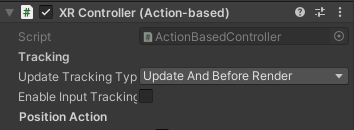

# Debug och gizmos

Både Debug och Gizmos används framför allt av spelutvecklare själva för att få syn på saker under spel. Kanske vill man rita ut något extra tydligt som inte syns för spelarna, kanske vill man bara ta reda på vilket värde en variabel har under körningen och hur det värdet ändras.

## Debug

### Debug.Log()

Används för att skriva ut saker till konsollen; motsvarande Console.WriteLine i vanlig C#-konsollprogrammering.

```csharp
Debug.Log($"Current X: {transform.position.x}");
```



Används ofta för att testa ifall kod överhuvudtaget körs eller för att se vilket värde olika variabler har.

### Debug.DrawLine()

Ritar ut en linje i scenvyn. Tar emot två vektorer som startposition och slutposition för linjen, och en färg. Om man vill kan man också ange ett antal sekunder som man vill att linjen ska dröja sig kvar.

```csharp
Debug.DrawLine(Vector2.right, Vector2.down, Color.green);
```

.png>)

## Gizmos

Gizmos är ett annat, mer flexibelt sätt att rita saker i scenvyn.

### OnDrawGizmos()

Gizmos ritas i en egen metod – OnDrawGizmos. Precis som andra metoder med namn på On… så anropas OnDrawGizmos alltid vid ett förbestämt tillfälle; i det här fallet när Unity-UIt uppdateras. Det gör också att man bör vara försiktig – skriver man kod i OnDrawGizmos som fastnar i en loop så finns risk att hela Unity blockeras.

```csharp
  void OnDrawGizmos()
  {
    Gizmos.color = Color.green;
    Gizmos.DrawLine(Vector3.right, Vector3.down);
  }
```

När man ritar gizmos bestäms färgen inte genom parametrar in i metoderna utan genom att man bestämmer vilken förg som ska användas "från och med nu".

### DrawLine()

Fungerar som Debug.DrawLine; man anger två vektorer.

```csharp
void OnDrawGizmos()
{
  Gizmos.color = Color.green;
  Gizmos.DrawLine(
    new Vector3(1,2), 
    new Vector3(2,1));
  Gizmos.DrawLine(
    new Vector3(2,1),
    new Vector3(2,2)
  );
}
```

.png>)

### DrawLineList()

Ritar ut linjer mellan en serie vektorer. Tar emot en lista eller en array av vektorer.

<pre class="language-csharp"><code class="lang-csharp"><strong>Gizmos.color = Color.green;
</strong>Vector3[] points = new Vector3[4]
  {
    new Vector3(-1, 0, 0),
    new Vector3(1, 0, 0),
    new Vector3(-1, 1, 0),
    new Vector3(1, 1, 0)
  };

Gizmos.DrawLineList(points);
</code></pre>

.png>)

### DrawWireCube()

Ritar ut en kub. Tar emot två vektorer, som bestämmer kubens position och storlek i x, y oxch z-led.

```csharp
void OnDrawGizmos()
{
  Gizmos.DrawWireCube(Vector3.zero, Vector3.one);
}
```

.png>)

### DrawWireSphere()

Ritar ut ett klot (egentligen tre cirklar längs olika axlar). Tar emot en vektor (mittpunkt) och en float som anger radien.

```csharp
void OnDrawGizmos()
{
  Gizmos.DrawWireSphere(Vector3.zero, 1);
}
```

.png>)
