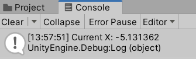

# Kollisioner

Unity kan känna av en kollision mellan två objekt, men bara om:

* Båda objekten har en **collider**.
* Båda dessa colliders är av samma "familj"; en 2d-collider kan inte kollidera med en 3d-collider.
* Minst ett av objekten har en **RigidBody** av samma familj.

Med andra ord: För ett 2d-spel, se till så att minst ett av två objekt som ska kunna kollidera har en rigidbody2d och att båda har en 2d-collider.

Om man inte behöver gravitation i sitt spel så kan man ändra Gravity Scale till 0.

För mer exakt kollisionshantering kan man ändra Collision Detection till Continuous, Sleeping Mode till Never Sleep och Interpolate till antingen Interpolate eller Extrapolate.



## Triggers

Trigger-colliders är colliders som inte har någon fysisk närvaro; de hindrar inte förflyttning och saker studsar inte från dem. Man förvandlar en vanlig collider till en trigger genom att kryssa i "Is Trigger".

## OnCollisionEnter2D()

Metoden OnCollisionEnter2D anropas när två objekt kolliderar och båda har vanliga 2d-colliders - och minst en av dem har en RigidBody. Om ett objekt har flera scripts med en OnCollisionEnter2D-metod så anropas samtliga.

Dess första parameter innehåller en referens till kollisionen, som bland annat innehåller information om det andra objektet.

```csharp
void OnCollisionEnter2D(Collision2D col)
{
  Debug.Log("OnCollisionEnter2D");
  if (col.gameObject.tag == "bullet")
  {
    Debug.Log("Bullet collision!");
  }
}
```

I ovanstående exempel används variabeln col som namn på kollisionen, och man kan därmed komma åt det andra spelobjektet genom att använda col.gameObject.

## OnTriggerEnter2D()

Om två objekt kolliderar och båda har 2d-colliders, men **den ena collidern är en trigger**, så anropas OnTriggerEnter2D istället för OnCollisionEnter2D. Metoderna fungerar i övrigt nästan likadant.

Skillnaden är att den första parametern innehåller en referens till det andra objektets collider, snarare än information om kollisionen i sig.

```csharp
void OnTriggerEnter2D(Collider2D other)
{
  Debug.Log("OnTriggerEnter2D");
  if (other.gameObject.tag == "trap")
  {
    Debug.Log("Trap triggered!!");
  }
}
```

I praktiken används de dock oftast likadant.

## OnCollisionEnter()

Fungerar likadant som 2D-versionen, förutom att den använder sig av RigidBody och vanliga Colliders snarare än 2D-versionerna.

```csharp
void OnCollisionEnter(Collision collision)
{
  Debug.Log("OnCollisionEnter");
  if (col.gameObject.tag == "bullet")
  {
    Debug.Log("Bullet collision!");
  }
}
```

## OnTriggerEnter()

Fungerar likadant som 2D-versionen, förutom att den använder sig av RigidBody och vanliga Colliders snarare än 2D-versionerna.

```csharp
void OnTriggerEnter(Collider other)
{
  Debug.Log("OnTriggerEnter");
  if (other.gameObject.tag == "trap")
  {
    Debug.Log("Trap triggered!!");
  }
}
```
